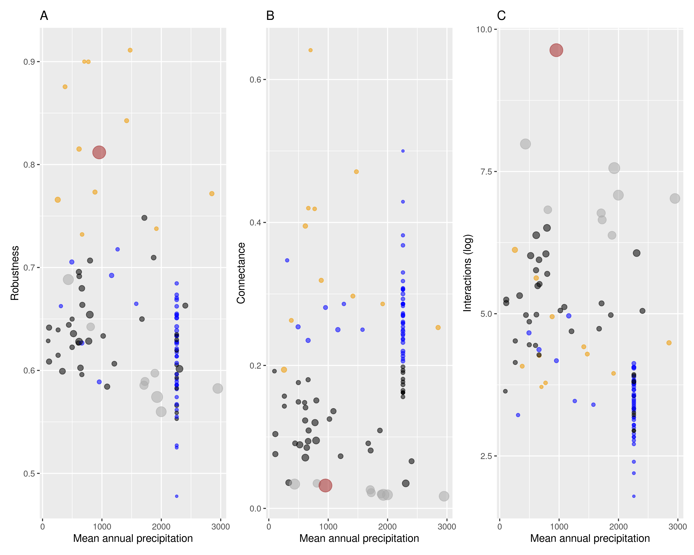
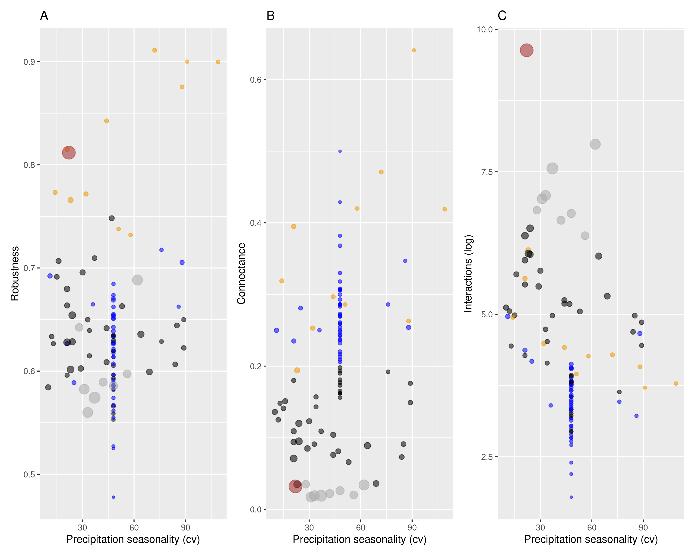

#### Author: Marcio Baldissera Cure

O objetivo deste documento é apresentar o meu trabalho final da disciplina **Introdução a redes ecológicas - Teoria e Prática**, ministrado pelas professoras [Carine Emer](http://lattes.cnpq.br/2953372411320303) e [Fernanda Costa](http://lattes.cnpq.br/9433727692500645).


### Resumo

Redes ecológicas são uma maneira de representar a estrurura das comunidades em termos de suas interações [Landi et al, 2018](https://doi.org/10.1007/s10144-018-0628-3). Por exemplo, a interação entre polinizadores e plantas é fundamental para a manutenção da biodiversidade e para a emergência de diversos serviços ecossistêmicos, inclusive os de suporte [MEA](https://www.millenniumassessment.org); [IPBES](https://ipbes.net/). As perdas de biodiversidade e as mudanças climáticas, que já ultrapassaram os limites seguros planetários ([Rockström et al, 2009](http://lattes.cnpq.br/9433727692500645)), poderiam impactar de forma irreversível as interações que estruturam os ecossistemas. De acordo com a teoria dos estados alternativos ([Beisner et al 2003](https://esajournals.onlinelibrary.wiley.com/doi/pdf/10.1890/1540-9295%282003%29001%5B0376%3AASSIE%5D2.0.CO%3B2)), sistemas submetidos a mudanças graduais podem responder de forma abrupta e não linear a mudanças ambientais ([Scheffer et al, 2001](https://www.nature.com/articles/35098000)). Dessa forma, eu testo a hipótese de que as métricas que descrevem a estrutura das redes de polinização na região tropical brasileira são sensíveis ao regime climático, assim como é a estrutura da vegetação ([Hirota et al, 2011](https://www.science.org/doi/10.1126/science.1210657)). Sendo assim, é possível testar o efeito das mudanças climáticas nestas redes ao longo de gradientes ambientais e, consequentemente, fazer inferências acerca da resiliência destas interações à mudanças futuras.

Por exemplo, sabe-se que, na região tropical, florestas e savannas são estados alternativos em termos estruturais (i.e. cobertura do dossel) parcialmente determinados pelo regime de precipitação ([Hirota et al, 2011](https://www.science.org/doi/10.1126/science.1210657); [Staver et al, 2011](https://www.science.org/doi/10.1126/science.1210465)). Estados alternativos têm estrutura diferentes, interações diferentes, propriedades emergentes diferentes, ou seja, possuem uma identididade diferente [Scheffer et al 2011](). 

No caso de florestas e savannas, a cobertura do dossel é usada como variável de estado. Em um gradiente ambiental até um certo limiar de condições um estado do sistema domina. A partir dali, o outro estado passaria a dominar. Os dois estados podem ocorrer sob as mesmas condições e isso é devido ao balanço entre os feedbacks positivos e negativos que emergem das interações dentro do sistema.

Eu pensei, entao, que como as redes ecológicas são formas de representar as interações dentro de ecossistemas, a estrutura destas redes poderia refletir a estabilidade em um gradiente de condições ambientais. 

A minha pergunta é: **existem estados alternativos em relação às métricas que definem a estrutura das redes em um gradiente climático?** Ou seja, vamos testar se **existe uma certa estabilidade interrompida abruptamente ao cruzar um certo limiar de condições**.


## Métodos

Os dados de polinização para a região tropical do Brasil foram obtidos a partir do [web-of-life dataset](https://www.web-of-life.es). Os dados climáticos foram obtidos usando a função ```raster::getData``` que busca os dados do [WorldClim](https://www.worldclim.org). Mas você também pode baixar direto do site.

Começa carregando os pacotes necessários:

```
library(tidyverse)
library(bipartite)
library(raster)
library(patchwork)
```

Unzipa os dados baixados do web-of-life:

```
lista_com_os_dados_baixados <- unzip("./web-of-life_2021-12-01_213658.zip")%>%
  as.list
```

Daí, separei algumas informações (objeto chamado de ```info```) de um dos arquivos baixados que são úteis.

```
info <- read.csv(lista_com_os_dados_baixados[1], h = T, row.names = 1) %>%
  select_("Species", "Interactions", "Connectance", "Latitude", "Longitude")
```


Modificação da lista: retirei uns dados que estavam atrapalhando por alguns motivos.

```
lista_com_os_dados_baixados <- lista_com_os_dados_baixados[-c(1, 2,135, 141, 142, 143)] 
```

Aqui eu leio cada elemento da lista como um arquivo .csv. Note que a classe do objeto ```lista``` continua como lista.

```
lista <- list(NULL)
for (i in 1:144) {
  lista[i] <- lista_com_os_dados_baixados[i] %>%
  map(read.csv, row.names=1,h=T)  
}
````

### Extinção
 
Agora, eu pego a lista que eu criei acima e aplico a função ```second.extinct``` para calcular a curva de extinção das plantas (low level) para cada __edge table__ contida nesta lista. Tudo isso coloquei em um objeto chamado de ```extinção_low```.

```
extinção_low <- lista[1:144] %>% 
  map(second.extinct,
      participant="lower",
      method="random",
      nrep=30,
      details=FALSE) 
```


### Robustez

Agora, finalmente calculamos a robustez que é o cálculo da área abaixo da curva de extinção gerada pela função anterior. Chamei o resultado de ```robustez_low``` e tirei do formato _lista_.

```
robustez_low <- extinção_low %>%
  map(robustness) %>%
  unlist()
  ```

Poderia fazer isso para outras funções também, como por exemplo, calcular a especialização complementar h2 como no exemplo abaixo.

```
especialização_complementar_h2 <- lista %>% 
  map(networklevel,index="H2") %>%
  map(data.frame) %>%
  unlist
```

Mas eu não vou fazer isso porque demora muito. :)

Aqui eu uso aquelas outras informações que me interessam que eu chamei lá em cima de ```info```.

Destes dados eu extraio as coordenadas (Longitude e Latitude dos meus dados).


```
xy <- data.frame(x=info$Longitude[-c(133, 139, 140,141,145)],
                 y=info$Latitude[-c(133, 139, 140,141,145)])
```

#### Agora as variáveis ambientais:

Note que eu já salvei os dados e agora estou simplesmente carregando como raster e extraindo os valores dos pixels correspondentes às nossas coordenadas. Para isso usei o pacote ```raster```.

Dados climáticos:

```
MAT <- raster("/home/marcio/PROJETOS-GIT/redes_ecologicas/wc2-5/bio1.bil") %>% raster::extract(xy)

MAP <- raster("/home/marcio/PROJETOS-GIT/redes_ecologicas/wc2-5/bio12.bil") %>% raster::extract(xy)

CV <- raster("/home/marcio/PROJETOS-GIT/redes_ecologicas/wc2-5/bio15.bil") %>% raster::extract(xy) 

TS <- raster("/home/marcio/PROJETOS-GIT/redes_ecologicas/wc2-5/bio4.bil") %>% raster::extract(xy) 

PDQ <- raster("/home/marcio/PROJETOS-GIT/redes_ecologicas/wc2-5/bio17.bil") %>% raster::extract(xy) 
```

Seleciona as informações contidas no objeto que chamamos de ```info```:

```
info1 <- info[-c(133, 139, 140,141,145),] %>% select_("Species", "Interactions", "Connectance", "Latitude", "Longitude")
```

```
dados <- cbind("Species" = info[-c(133, 139, 140,141,145),] %>%
                 select_("Species"),
               "Interactions" = info[-c(133, 139, 140,141,145),] %>%
                 select_("Interactions") ,
               "Connectance" = info[-c(133, 139, 140,141,145),] %>%
                 select_("Connectance") ,
               robustez_low,
               MAT, MAP, CV, TS, PDQ,
               "Latitude"=info1$Latitude,
               "Longitude"=info1$Longitude)
```

Vou separar os dados da regiao tropical das altas latitudes:

```
info_tropical <- dados %>% 
  filter(Latitude>=-25 & Latitude<=25) %>%
  add_column(Região="Tropical")

info_high_lat <- dados  %>%
  filter(Latitude<-25 & Latitude>25) %>%
  add_column(Região="High latitude")
```

...e salvar em um objeto chamado dados1.

```
dados1 <- rbind(info_tropical, info_high_lat)
```


## Resultados:


Agora, vamos ver como as métricas variam em função das condições ambientais usando o ```ggplot2```.

Os pontos de cor laranja representam as amostragens feitas em lugares tropicais e os pontos cinza são aqueles amostrados fora dos trópicos. O tamanho dos pontos corresponde ao número de espécies.

#### Temperatura média anual

```
# Mean annual temperature
MAT.robus <- dados1 %>% ggplot()+
  aes(x=MAT, y=robustez_low, size=Species, alpha=0.6, color=factor(Região))+
  geom_point(show.legend = F)+
  xlab("Mean annual temperature")+
  ylab("Robustness")+
  scale_color_manual(values=c("darkgrey", "orange2"))+
  ggtitle("A")

MAT.conn <- dados1 %>% ggplot()+
  aes(x=MAT, y=Connectance, size=Species, alpha=0.6, color=factor(Região))+
  geom_point(show.legend = F)+
  xlab("Mean annual temperature")+
  ylab("Connectance")+
  scale_color_manual(values=c("darkgrey", "orange2"))+
  ggtitle("B")

MAT.inter <- dados1 %>% ggplot()+
  aes(x=MAT, y=Interactions %>% log, size=Species, alpha=0.6, color=factor(Região))+
  geom_point(show.legend = F)+
  xlab("Mean annual temperature")+
  ylab("Interactions (log)")+
  scale_color_manual(values=c("darkgrey", "orange2"))+
  ggtitle("C")
```


#### Precipitação média anual

```
# Mean annual precipitation
MAP.robus <- dados1 %>% ggplot()+
  aes(x=MAP, y=robustez_low, size=Species, alpha=0.6, color=factor(Região))+
  geom_point(show.legend = F)+
  xlab("Mean annual precipitation")+
  ylab("Robustness")+
  scale_color_manual(values=c("darkgrey", "orange2"))+
  ggtitle("A")

MAP.conn <- dados1 %>% ggplot()+
  aes(x=MAP, y=Connectance, size=Species, alpha=0.6, color=factor(Região))+
  geom_point(show.legend = F)+
  xlab("Mean annual precipitation")+
  ylab("Connectance")+
  scale_color_manual(values=c("darkgrey", "orange2"))+
  ggtitle("B")

MAP.inter <- dados1 %>% ggplot()+
  aes(x=MAP, y=Interactions %>% log, size=Species, alpha=0.6, color=factor(Região))+
  geom_point(show.legend = F)+
  xlab("Mean annual precipitation")+
  ylab("Interactions (log)")+
  scale_color_manual(values=c("darkgrey", "orange2"))+
  ggtitle("C")
```




#### Sazonalidade na precipitação (coeficiente de variação)

```
# precipitation seasonality (coefficient of variation)
CV.robus <- dados1 %>% ggplot()+
  aes(x=CV, y=robustez_low, size=Species, alpha=0.6, color=factor(Região))+
  geom_point(show.legend = F)+
  xlab("Precipitation seasonality (cv)")+
  ylab("Robustness")+
  scale_color_manual(values=c("darkgrey", "orange2"))+
  ggtitle("A")

CV.conn <- dados1 %>% ggplot()+
  aes(x=CV, y=Connectance, size=Species, alpha=0.6, color=factor(Região))+
  geom_point(show.legend = F)+
  xlab("Precipitation seasonality (cv)")+
  ylab("Connectance")+
  scale_color_manual(values=c("darkgrey", "orange2"))+
  ggtitle("B")

CV.inter <- dados1 %>% ggplot()+
  aes(x=CV, y=Interactions %>% log, size=Species, alpha=0.6, color=factor(Região))+
  geom_point(show.legend = F)+
  xlab("Precipitation seasonality (cv)")+
  ylab("Interactions (log)")+
  scale_color_manual(values=c("darkgrey", "orange2"))+
  ggtitle("C")
```




#### Sazonalidade da temperatura

```
# temperature seasonality
TS.robus <- dados1 %>% ggplot()+
  aes(x=TS, y=robustez_low, size=Species, alpha=0.6, color=factor(Região))+
  geom_point(show.legend = F)+
  xlab("Temperature seasonality")+
  ylab("Robustness")+
  scale_color_manual(values=c("darkgrey", "orange2"))+
  ggtitle("A")

TS.conn <- dados1 %>% ggplot()+
  aes(x=TS, y=Connectance, size=Species, alpha=0.6, color=factor(Região))+
  geom_point(show.legend = F)+
  xlab("Temperature seasonality")+
  ylab("Connectance")+
  scale_color_manual(values=c("darkgrey", "orange2"))+
  ggtitle("B")

TS.inter <- dados1 %>% ggplot()+
  aes(x=TS, y=Interactions %>% log, size=Species, alpha=0.6, color=factor(Região))+
  geom_point(show.legend = F)+
  xlab("Temperature seasonality")+
  ylab("Interactions (log)")+
  scale_color_manual(values=c("darkgrey", "orange2"))+
  ggtitle("C")
```


#### Densidade de distribuição das métricas

```
densidade_rob <- dados1 %>% ggplot() +
  geom_density(aes(x=robustez_low, col = factor(Região), alpha=0.5), show.legend = F)+
  xlab("Robustness")+
  scale_color_manual(values=c("darkgrey", "orange2"))+
  ggtitle("A")

densidade_int <- dados1 %>% ggplot() +
  geom_density(aes(x=Interactions %>% log, col = factor(Região), alpha=0.5), show.legend = F)+
  xlab("Interactions (log)")+
  scale_color_manual(values=c("darkgrey", "orange2"))+
  ggtitle("B")

densidade_con <- dados1 %>% ggplot() +
  geom_density(aes(x=Connectance, col = factor(Região), alpha=0.5), show.legend = F)+
  xlab("Connectance")+
  scale_color_manual(values=c("darkgrey", "orange2"))+
  ggtitle("C")

```


## Considerações finais:

O próximo passo seria testar estas mesmas métricas, mas separando por:

1. Cobertura do dossel; pra ver de forma simples e generalizada, mas mesmo assim bem frequente e aceita na literatura, se tipos diferentes de vegetação possuem padrões de resposta diferentes.

2. Guildas; pra ver se diferentes guildas possuem padrão de resposta diferentes.


Dúvidas? Entre em contato:

</br>

<footer><p class="small">

<h3>Contatos:</h3>

<div>
<a href = "mailto:marciobcure@gmail.com"></a>
 <a href="https://instagram.com/marciobcure" target="_blank"></a>
</div>
</p></footer>
